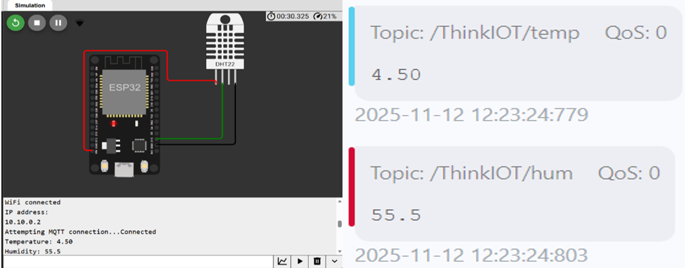
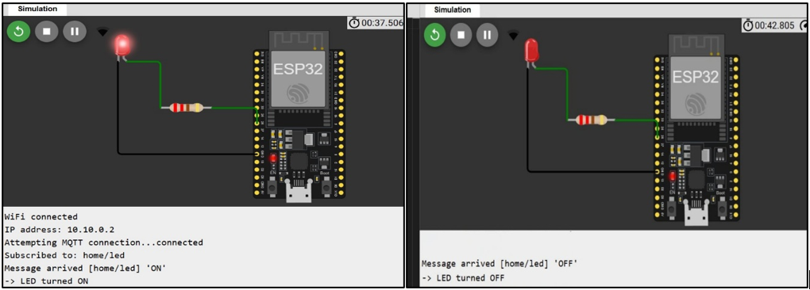
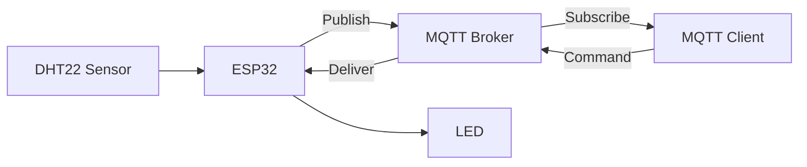

# 🌐 Smart Environmental Monitoring & Remote LED Control using MQTT

  
  

---

## 🚀 Project Overview

This project demonstrates a **real-time IoT system** built using the **ESP32** and the **MQTT protocol**.

It enables:

- 🌡️ Live monitoring of **temperature and humidity**
- ☁️ Cloud-based data transmission
- 💡 Remote control of devices (LED)

The system showcases **two-way communication** between hardware and cloud, which is a core concept in modern IoT systems.

---

## 🧠 Core Concepts

- IoT (Internet of Things)
- MQTT Publish–Subscribe Model
- Real-time Data Communication
- Embedded Systems (ESP32)
- Cloud Messaging Systems

---

## 🏗️ System Architecture

---

## ⚙️ Features

### 🌡️ Environmental Monitoring
- Reads temperature and humidity using DHT22
- Sends data every **2 seconds**
- MQTT Topics:
  - `/ThinkIOT/temp`
  - `/ThinkIOT/hum`
- Enables real-time monitoring via MQTT clients

---

### 💡 Remote LED Control
- Subscribes to:
  - `home/led`
- Supported commands:
  - `ON` → LED turns ON
  - `OFF` → LED turns OFF
- Instant cloud-to-device communication

---

## 🔌 Hardware Used

- ESP32 Microcontroller  
- DHT22 Sensor  
- LED + Resistor  
- Jumper Wires  

---

## 💻 Software & Tools

- Arduino IDE  
- MQTT Client (MQTTx recommended)  

### Required Libraries
- WiFi.h  
- PubSubClient.h  
- DHTesp.h  

---

## 🌐 MQTT Configuration

| Parameter | Value |
|----------|------|
| Broker   | test.mosquitto.org / HiveMQ |
| Port     | 1883 |
| Protocol | MQTT |

---

## 📡 MQTT Topics

| Topic            | Type      | Purpose              |
|------------------|----------|----------------------|
| /ThinkIOT/temp   | Publish  | Temperature data     |
| /ThinkIOT/hum    | Publish  | Humidity data        |
| home/led         | Subscribe| LED control commands |

---

## 🔄 Working

### 📤 Sensor → Cloud
1. ESP32 connects to Wi-Fi  
2. Reads DHT22 data  
3. Publishes values to MQTT broker  
4. MQTT client receives live data  

---

### 📥 User → Device
1. User sends command (`ON/OFF`)  
2. Broker forwards message  
3. ESP32 processes input  
4. LED switches accordingly  

---

## 🧪 Results

- ✅ Successful Wi-Fi + MQTT connection  
- ✅ Continuous real-time data transmission  
- ✅ MQTT client received:
  - Temperature: **4.50°C**
  - Humidity: **55.5%**
- ✅ LED responded instantly to commands  

---

## ⚠️ Challenges

- MQTT reconnection handling  
- Wi-Fi instability  
- Message formatting issues  
- Sync between publish & subscribe  

---

## 🔧 Future Enhancements

- 📱 Mobile App Integration  
- 📊 Dashboard (Node-RED / Grafana)  
- 🔒 Secure MQTT (TLS/SSL)  
- ☁️ Cloud Platforms (AWS IoT, Firebase)  

---

## 🎯 Applications

- Smart Homes  
- Weather Monitoring  
- Industrial IoT  
- Agriculture Systems  

---

## 👨‍💻 Team

- Charan Mahendaran  
- Aditya Nimbargi  
- Likhith K  

---

## 📜 License

This project is intended for **academic and educational use**.

---

## ⭐ Support

If you found this useful:

- ⭐ Star the repo  
- 🍴 Fork it  
- 📢 Share it  

---

## 🔥 Final Note

This project builds a **strong foundation in IoT**, combining embedded systems with real-time cloud communication—an essential skill for modern engineers.
